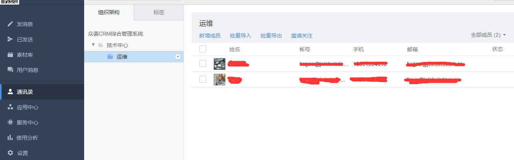

# zabbix-alert-wechat

### 微信报警
1. 申请微信企业公众号 [点击注册](https://qy.weixin.qq.com/)

2. 微信公众号设置
```text
1.通讯录设置
  登陆微信企业号控制台  
  点击左侧"通讯录",新增部门(技术部)与子部门(运维部),并添加用户
  点击(运维部)后方的三角,修改部门,记录**部门ID**  

2.创建应用
  点击左侧"应用中心",新建消息型应用,应用名称为"Alarm"
  "应用可见范围",添加刚刚新建的子部门(运维部)  
  点击"Alarm",记录**应用ID**

3.应用权限设置
  点击左侧"设置",权限管理,新建普通管理组,名称填写"Alarm Group"
  点击修改"通讯录权限",勾选(技术部)后方的管理
  点击修改"应用权限",勾选刚刚创建的"Alarm"
  点击刚刚创建的"Alarm Group",记录左侧的**CorpID与Secret**

4.收集微信相关信息
  * 记录**应用ID**
  * 记录**CorpID与Secret**
  * 记录**子部门(运维部)ID**

5.微信Debug测试
  http://qydev.weixin.qq.com/debug
```



### zabbix 设置
1. zabbix设置报警脚本存放位置
```bash
mkdir /etc/zabbix/zabbix_alert

vim /etc/zabbix/zabbix_server.conf
AlertScriptsPath=/etc/zabbix/zabbix_alert

systemctl restart zabbix-server
```

2. 下载微信脚本
```bash
git clone https://github.com/smallasa/zabbix-alert-wechat.git
cp zabbix-alert-wechat/sendwechat.py /etc/zabbix/zabbix_alert
chmod +x /etc/zabbix/zabbix_alert/sendwechat.py
```

3. 安装python模块
```bash
pip install simplejson urllib urllib2
```

4. 添加示警媒介
```text
Administration --> Media types --> create media types

Name: To_WeChat
Type: Script
Script name: sendwechat.py
Script parameters: {ALERT.SENDTO}
Script parameters: {ALERT.SUBJECT}
Script parameters: {ALERT.MESSAGE}
```

5. 为用户添加示警媒介
```text
Administration --> Users --> User group --> Create user

单击刚刚创建的User,选择Media,添加预警用户
Type: To_WeChat
Sendto: {WechatID}  注意这里填写的是企业号通讯录部门ID
其它默认
```

6. 设置Action
```text
Configuration --> Actions --> Event Sources(Triggers) --> Create Action
```
